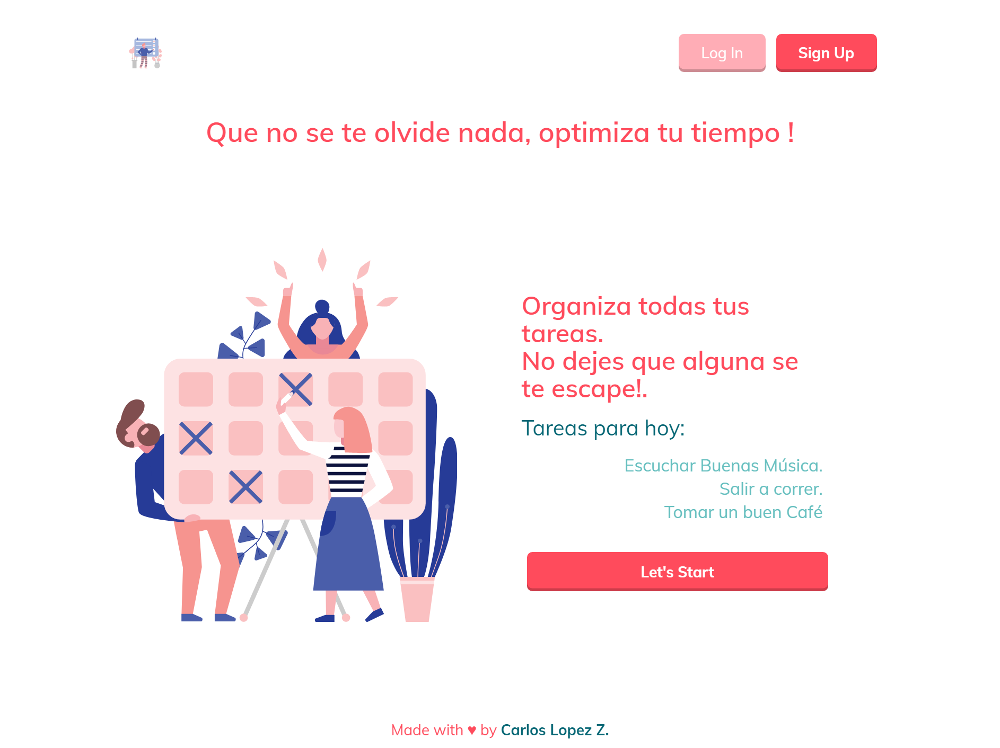

# Simple Task User - Python and Flask

:memo:

  **The purpose of this challenge is: continues with my learn about Python and Flask**

## Start 🚀

_Only you need to download the files and run pip install to setup all dependencies._

```
pip install -r requirements.txt
```

Now **Deployment** try run this script to see the project on your computer.

```
bash run.sh
```
_Now see the project in_ **localhost:3000**

## Preview :art:

You can see the live result here → [Article Preview Component](https://todo-user-project.uc.r.appspot.com/home)

🖥 Desktop version




## :pill: Technologies
1. Python
2. Flask
3. Jinja
4. AppEngine
